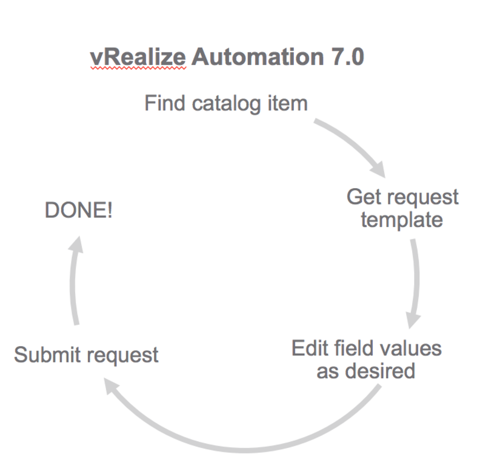

# vRealize Automation - Catalog Service

The catalog service REST API is designed to be used by the consumers of the service catalog; for example, an end user who wants to request a catalog item would be a consumer of this API. 

## Available Use Cases

### Catalog Item Request Submission

You can use the following workflow to submit a catalog request programmatically. A sample of this workflow is available in the postman collection for catalog service.

[image credit](https://blogs.vmware.com/management/files/2015/10/API-request-template.png)

### Request Tracking

 * Track catalog request for a given user
 * Track individual component requests
 * Get deployment and resources for the deployment for a given request.
 * Get all failed requests for a given tenant

[A blog about request tracking](https://blogs.vmware.com/management/2015/10/self-service-apis-simplified-vrealize-automation-7-0.html)

### Day 2

 * List all provisioned resources
 * Get components of a deployment
 * Get a resource
 * Get available resource actions
 * Get resource action request template
 * Submit day 2 resource actions

### Day 2 Machine Actions

 * Submit a reconfigure request
 * Scale out machines
 * Scale out machines with nested blueprint
 * Change Owner

*[vRealize Automation API Tips](../API%20Tips)*