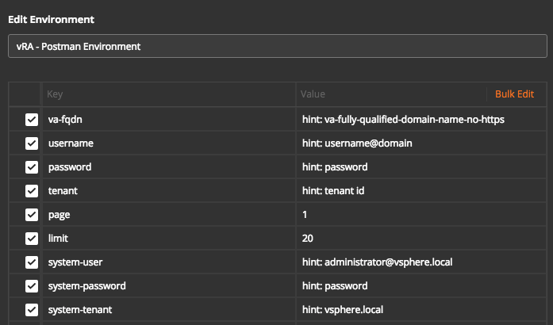
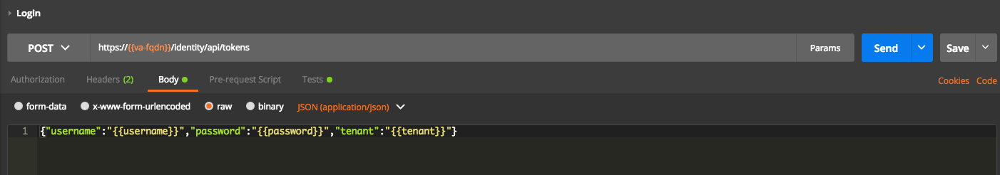
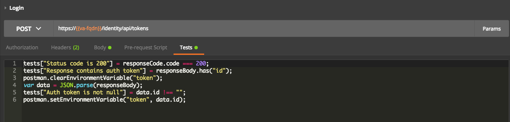
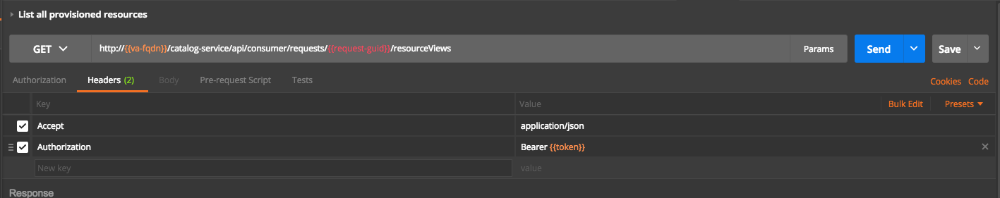

# vRealize Automation API Samples for Postman

## Overview

The vRealize Automation REST API provides consumer, administrator, and provider-level access to the service catalog with the same services that support the vRealize Automation console user interface. You can perform vRealize Automation functions programmatically by using REST API service calls. These samples will provide a reference how you can leverage common use cases in vRealize Automation REST APIs.

## Try it Out

### Prerequisites

 * [Postman Rest Client](https://www.getpostman.com)
 * (Optional but recommended) [Learn how to use Postman](https://www.getpostman.com/docs/), it is quite simple.

### How-To

 * Import vRA - Postman Environment.postman_environment.json
 * Define Postman environments
   * va-fqdn: Hostname/IP for the Cafe virtual appliance (or load balancer), No HTTPS, just FQDN/IP. If no default port then suffix with ":port"
   * username: A tenant user with the format of username@domain
   * password: The password for the above username
   * tenant: The tenant for which the APIs are executed.
   * page: Default page when more than one page is returned in a GET call
   * limit: Page limit, It limits the number of objects returend in per page
   * system-user: A system level user e.g. administrator@vsphere.local
   * system-password: The password for system level user
   * system-tenant: The system tenant e.g. vsphere.local
  * Select "vRA - Postman Environment in Postman"

Example:

```
* va-fqdn: vra-prod.company.com
* username: vra-user@company.com
* password: ...
* tenant: prod
* system-user: administrator@vsphere.local
* system-password: ...
* system-tenant: vsphere.local
```

### Importing Postman Collection

You can import the folder or the individual collection in the folder.

### General Notes

#### Authentication
Most of the vRA APIs are authorized by relevant roles. Before executing any API, make sure you login. Each of these use cases should have a login method. Send a login call after setting postman environment and it will retrieve the token and will set in environment variable in Postman. There is no need to copy the token over to next API method authorization header as all the APIs headers are set. Here are the steps:

**Set environment in Postman**



**Login**

Use any of the Login calls available in samples collection.



When login is successful the environment variable {{token}} will be set.



**Subsquent API Calls**

Once the token is acquired, you can make subsequent calls as below. The {{token}} will be automatically passed to the request as acquired by login call.



#### Variables

Some API calls may require you to replace variables in URLs, request body etc. All variables are formatted as {{variable-name}}. You should replace them with a desired value before executing the method. You do not need to replace environment variables that you define as described above.

Before - The call in the postman collection will be:

```
https://{{va-fqdn}}/catalog-service/api/consumer/resources?$filter=owners/ref eq '{{username@domain}}'&page={{page}}&limit={{limit}}
```

After - you just need to replace {{username@domain}} with desired value.
```
https://{{va-fqdn}}/catalog-service/api/consumer/resources?$filter=owners/ref eq 'vra-user@company.com'&page={{page}}&limit={{limit}}
```

### Use Cases

* Expand documentation of these use cases with [Postman's guidelines](https://www.getpostman.com/docs/creating_documentation.
* Please read the respective README.md file for each folder what use case are provided as samples. 

## Contributing

The vra-api-samples-for-postman project team welcomes contributions from the community. If you wish to contribute code and you have not signed our contributor license agreement (CLA), our bot will update the issue when you open a Pull Request. For any questions about the CLA process, please refer to our FAQ. For more detailed information, refer to [CONTRIBUTING](CONTRIBUTING.md).

## License

All files are released under the terms of the MIT License, see the [LICENSE](LICENSE.txt) file in the root of this project.