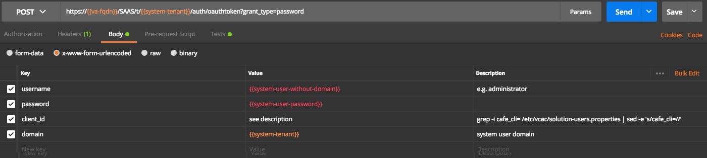

# vRO API Samples

Note: This is a first sample, will need improvements.

## Available Use Cases

* Get vRO API bearer token
* Get workflows

How to get vRO auth token



```
username: administrator
password: password for the username
client_id: get the output from Cafe VA: grep -i cafe_cli= /etc/vcac/solution-users.properties | sed -e 's/cafe_cli=//'
domain: vsphere.local or similar
```

*[vRealize Automation API Tips](../API%20Tips)*